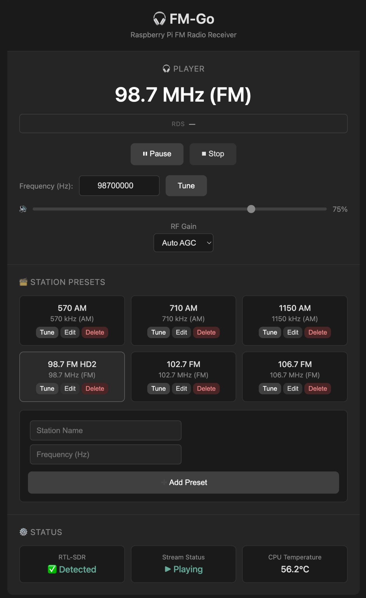

# PiFM 🎧

A plug-and-play Raspberry Pi FM radio receiver. Turn a Pi into a headless, always-on network radio with a simple web interface.

[](https://opensource.org/licenses/MIT)



## Quick Start

**One-command install:**

```bash
curl -sSL https://raw.githubusercontent.com/rossingram/PiFM/main/install.sh | sudo bash
```

**Or from repo:**

```bash
git clone https://github.com/rossingram/PiFM.git
cd PiFM
sudo ./install.sh
```

Then open **http://\<pi-ip\>:8080** in a browser. Plug in your RTL-SDR and tap **Play**.

## Requirements

- Raspberry Pi (3B+, 4, or 5)
- Official Pi power supply (5V 2.5A+ for Pi 3B+, 5V 3A+ for Pi 4)
- RTL-SDR dongle
- Network (Ethernet or Wi‑Fi)
- microSD card

## Features

- One-command installation
- Web UI: play/pause, volume, frequency, presets
- **FM** (87.5–108 MHz) and **AM** (530–1700 kHz) broadcast
- RTL-SDR detection (non-intrusive; device opened only when streaming)
- Default low gain to avoid overload (e.g. with high-gain antenna)
- systemd service, starts on boot
- **RDS** – UI shows station/song info when available; RTL-SDR V4 can receive RDS, but decoding requires an FM multiplex (171 kHz) pipeline (e.g. [redsea](https://github.com/windytan/redsea)); planned for a future update

## Docs

- [Installation](docs/INSTALL.md) – install options and what the installer does
- [Troubleshooting](docs/TROUBLESHOOTING.md) – SDR not detected, drops when playing, service issues
- [Development](docs/DEVELOPMENT.md) – project layout, local run, pushing to GitHub

## License

MIT – see [LICENSE](LICENSE).
